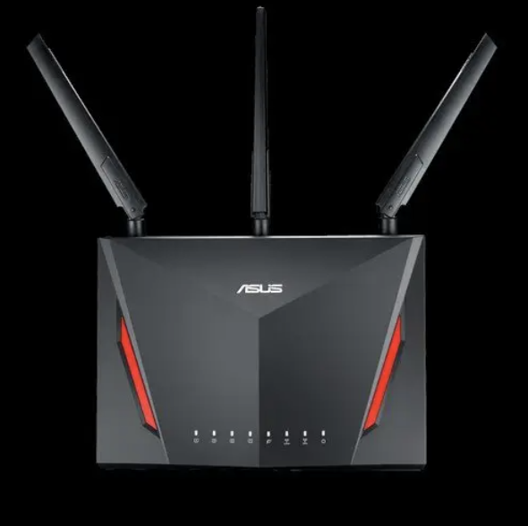
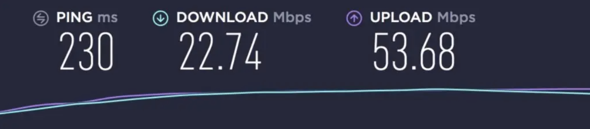
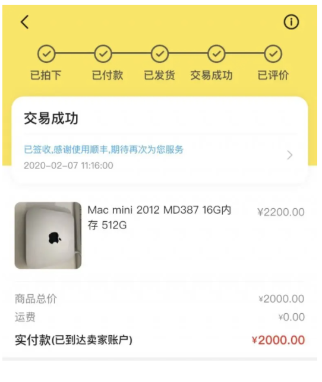
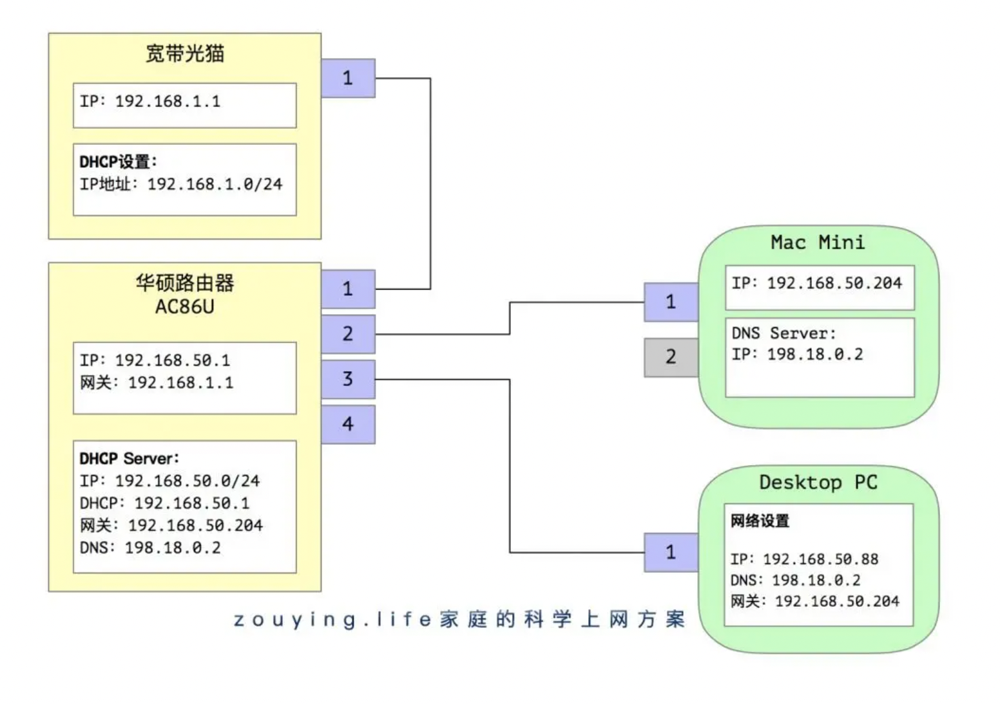
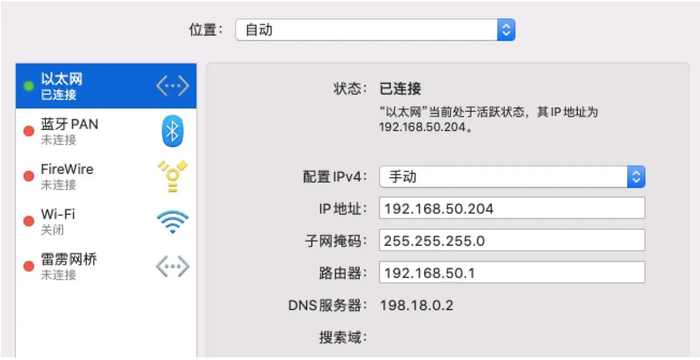
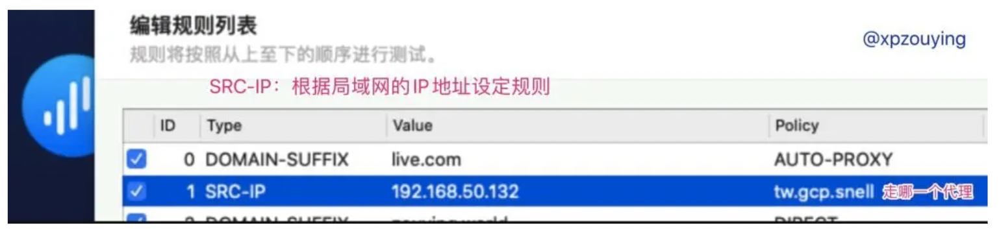
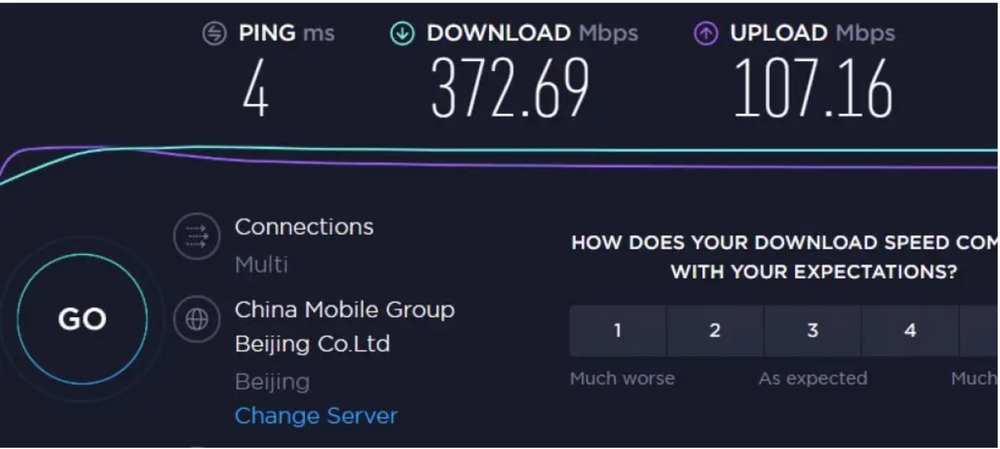
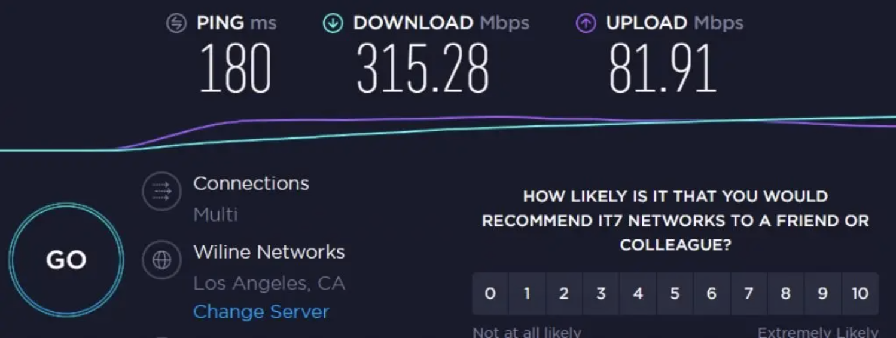
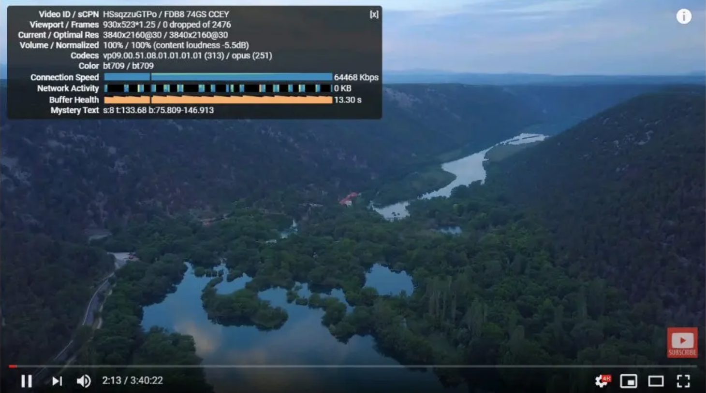
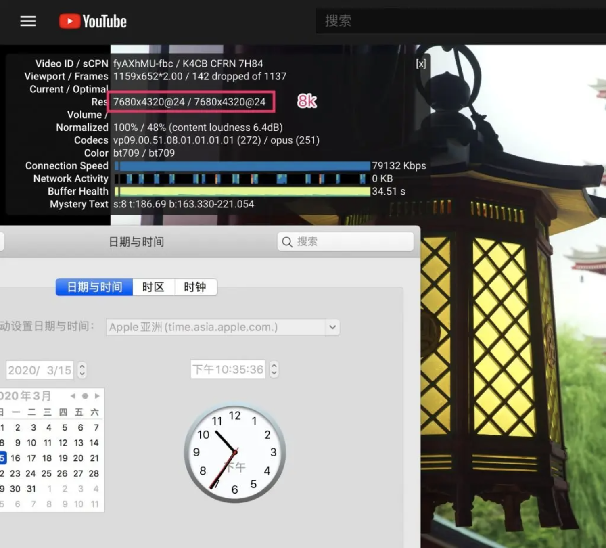

# 搭建家庭的科学上网方案

## 前言

之前一直是在使用`Surge`+`MacOS`搭建家里的上网方案。但是由于`Surge`的订阅付费模式的问题，导致我个人的`Surge 3`不再更新，作者应该是放弃3版本，直接维护4版本去了。

原本想购买`Surge 4`，但是，一方面又担心作者过一段时间直接放弃`Surge 4`又去搞V5版本，实在跟不上节奏。另一方面，由于自己正好又买了Intel NUC 11搞了套Homelab，所以也想尝试一下OpenWrt的功能。

## 家庭上网方案的迭代

之前有写过文章，如：[利用Surge网关功能搭建家庭科学上网方案](https://zouying.world/surge-network/)。

以后都统一放到[github.com/xpzouying/zy-notes](https://github.com/xpzouying/zy-notes)这里吧。

本文介绍我的科学上网经历。家中的宽带为中国移动500M宽带，使用SpeedTest测试结果为380M左右。

### 1.0版本：设备自己负责

**第一个版本：初出茅庐，每个终端负责自己的科学上网**

每个终端设备（包括手机、电脑）负责各自的科学上网。每个设备安装各自的科学上网App，各自配置规则。

**不足之处：**

1. 家里有N个设备，若每一台都需要科学上网，那么就需要在N个设备上面都安装科学上网软件（或App）。
2. 家中有些设备，比如任天堂的Switch，系统升级时，没有连接外网的情况下，经常提示出错，据说这种情况在北京移动宽带下，出现的概率最高。
3. 不能统一设定一套科学上网规则。修改规则时，需要在N台设备上都设置一遍。
4. 不同的科学上网软件，性能不同。

### 2.0版本：使用路由器的科学上网插件

为了避免第一种情况中的不足，我购入了[华硕路由器AC86U](https://www.asus.com.cn/Networking/RT-AC86U/)，并且刷了梅林固件，安装了科学上网插件。

通过梅林固件+科学上网固件，终于实现了中心管理控制科学上网，只要连接家里的路由器，就自带了科学上网😄。

**不足之处：**

1. 科学上网规则简单，只能统一走一个代理节点，不能实现：上Youtube走美国节点，上奈飞走香港节点。
2. 路由器CPU性能不足。现在的科学上网为防止被监测，一般都使用了某种方式进行了加密，比如aes-128-gcm等。当路由器进行加解密时，CPU性能不足的劣势尤为明显。

使用v2ray + websocket，路由器测试情况如下，

- SpeedTest的结果：

  

- CPU和内存的情况：

  

可以看到差不多到**50+M速度**时，这款华硕路由器就很吃力了。另外内存一直是这款路由器的弊病，即使安装U盘虚拟内存插件，路由器系统的内存也是明显的短板。

整体来说，路由器的CPU性能太差，已经成了木桶效应的最短板了。

### 3.0版本：软路由（未实际使用）

为了优化科学上网的速度，突破第二个版本中50M左右的速度，中间考虑软路由。具体软路由的细节，未来有机会再说。总体来说，软路由就是一台电脑，主要分为两种：

1. 工控机：
   1. 自带多网口
   2. 体积小
   3. 功耗小
2. 自己组装：
   1. 外观不好看；体积不可控，一般做不到工控机那么小的体积
   2. 一般情况下，只有一个网卡
   3. 功耗比较高，降频节电模式不确定效果

考虑一番后，决定放弃软路由：

1. 工控机现在价格炒的太高，比如某凌工控机，3855U的准系统（不带内存、硬盘）大概要1100-1200。
2. 组装机，合适的硬件不好找（不管是小机箱还是主板）。保证体积小的前提下，组装也比较麻烦。

最重要的一点是，发现闲鱼上面购入一台Mac Mini（2012年late版，16G内存，512G SSD硬盘），包顺丰只需要2000RMB。

### 4.0版本：Mac Mini + Surge

由于我之前原本就购入Surge MacOS，所以直接就使用了Surge作为科学上网的工具，其他同类型的产品应该能达到相似的效果。各个设备的配置情况如下：

**华硕路由器：**

- 提供DHCP服务器
  - DHCP地址规划：192.168.50.0/24
  - 默认网关：192.168.50.204 （Mac Mini的IP地址）
  - DNS：198.18.0.2 （Surge的Fake IP地址）
- 提供无线连接

**Mac Mini：**使用有线连入华硕路由器

- MacOS的网络配置为：
  - 手动配置IP：192.168.50.204
  - 网关设置：192.168.50.1 （华硕路由器）
  - DNS服务器为：192.168.50.1 (华硕路由器)
- 安装Surge MacOS，配置科学上网
- 作为家庭网络的网关
- 提供DNS服务：使用Surge MacOS软件，需`开启Surge增强模式`，自动打开**198.18.0.2**。

**家庭科学上网方案如下：**

**Mac Mini的网络配置：**

如果局域网类的设备不需要走代理，希望直连。可配置Surge规则：

## 效果测试

使用Mac+Surge进行科学上网后，进行测试。

### **SpeedTest测试（宽带速度）：**

### **SpeedTest测试（科学上网速度）：**

### **YouTube 4K视频的测试：**

**测试时间：**晚上18:25分

### **Youtube 8k视频的测试：**

**测试时间：** 晚上10点半左右

8k60也勉强能看。

## 总结

目前很满意这套科学上网的方案，Mac系统的稳定性和功耗、Surge规则的灵活性、加上好的VPS提供整体稳定的上网速度，即使在晚高峰时间段，表现也相当喜人。

Mac Mini只使用了单根网线（因为只有一个网卡），同时提供有雷电接口，我有一个苹果的雷电接口转网卡配件，暂时没有用上，后续发现网络瓶颈时再增加另外一个网线，提升吞吐量。

## 更新：汇总一些常见问题

### 关于中国移动宽带的问题

不少人咨询中国移动宽带使用什么VPS服务，再次更新我的经验。

移动宽带确实非常恶心，特别是晚上容易爆炸。尝试了各种各样的服务商：谷歌云、亚马逊云、微软云、Linode、Vultr等等。总结一下我使用过的运营商的结果：

1. [谷歌云](https://console.cloud.google.com/compute/instances)（台湾/香港）：新用户可以获赠300刀的试用，一年的使用时间。
   - 电信宽带：实测非常好。
   - 移动宽带：香港节点完全不可用。台湾节点：ping非常快，但是会丢包。上网情况：白天，看网页、刷twitter一般没有问题，晚上特别慢。

1. [Linode](https://www.linode.com/?r=58a0d479b585afa3d1ed7b0e38569489732f71c7)：用过日本/新加坡节点，上网看网页可用，看视频卡。每个月1TB或者2TB的流量，已经足够用了。最低配置的节点一个月5美刀，需要登记信用卡支付，每个月自动扣款，按时长计费，可能会细化到分钟或者小时。
2. [Vultr](https://www.vultr.com/?ref=8688489-6G)：在搬到搬瓦工之前，一直使用新加坡节点。还比较稳定，Youtube清晰度到480p/720p应该没有问题。Google相关的服务会定位到Google印尼或者菲律宾（记得不是很清楚了，可以打开youtube后，观察youtube的logo显示地理信息）。最低配置的节点是一个月5美刀，1TB或2TB的流量。比Linode人性化的点是支持支付宝预付款，也是按使用时长计费。
3. [搬瓦工](https://bandwagonhost.com/aff.php?aff=57086)：现在正在使用，因为一开始接触科学上网时，网上有大量的人发邀请码推荐，所以一直认为是最low的，以前一直没有尝试，在被谷歌云、亚马逊云虐了千百遍后，终于开通了搬瓦工的**CN2 GIA** VPS。

强烈推荐移动宽带使用CN2 GIA线路。【这里也顺便附上我的邀请码😛】

- [搬瓦工 VPS邀请](https://bandwagonhost.com/aff.php?aff=57086)
- [搬瓦工官方机场：JustMySocks](https://justmysocks.net/members/aff.php?aff=9763)

搬瓦工测试过的是**DC6、DC9**机房的，都是**CN2 GIA线路**，其他的没有测试过，不知道效果。

建议你可以直接付款尝试，如果不好直接申请退款即可，非常方便。

注意选择 CN2 GIA线路，是DC6机房。

搬瓦工官方机场服务**JustMySocks**是DC9机房，也是CN2 GIA，速度更优质，但是只提供ss，优点是使用域名访问，不用担心后面的IP被封，搬瓦工会自动维护IP。
