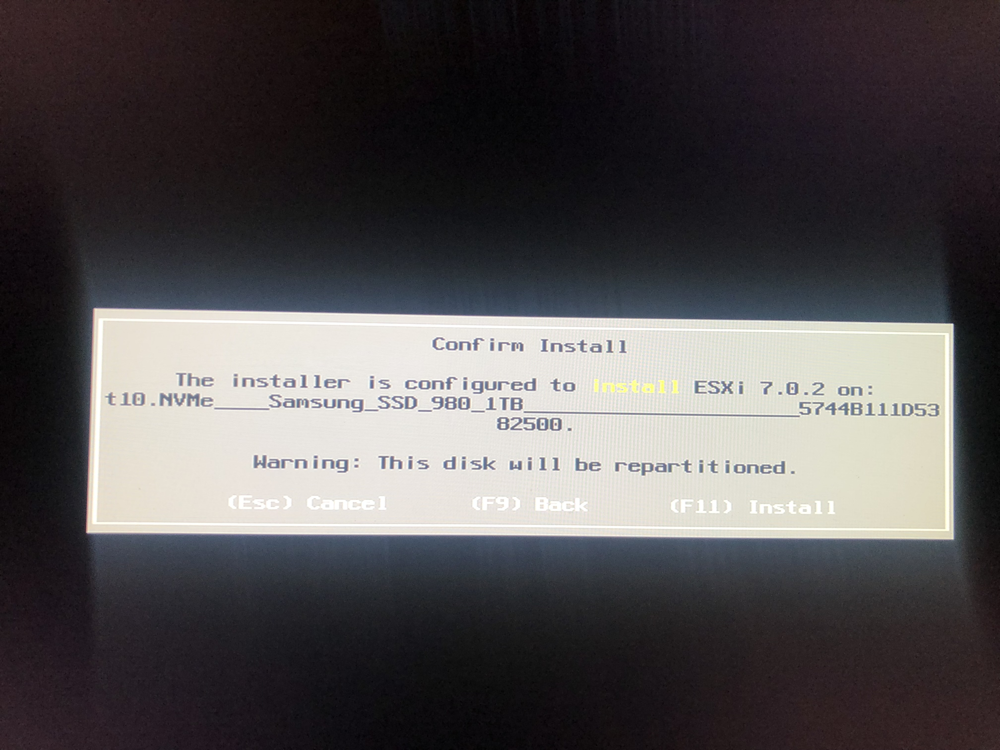

# Homelab - Intel NUC 11 安装Esxi 7

Intel NUC 11安装Esxi7时，需要网卡驱动。


本文介绍成功安装Esxi7的流程和注意事项。

## 硬件设备

### Intel NUC

想买一台NUC是作为家里的`Homelab`使用，对比了i7和i5的CPU性能和某东上面的报价后，选择了`i5`CPU的系列。

具体型号为：
  - [Intel NUC 11 - NUC11PAHi5](https://ark.intel.com/content/www/us/en/ark/products/205040/intel-nuc-11-performance-kit-nuc11pahi5.html)
  - [某东链接](https://item.m.jd.com/product/10026860758541.html?&utm_source=iosapp&utm_medium=appshare&utm_campaign=t_335139774&utm_term=CopyURL&ad_od=share&utm_user=plusmember&gx=RnFixzELb2DQztTBJyih-9Vsz4lunZA)

在这里需要注意的是：
  - 网卡型号为：`Intel® Ethernet Controller i225-V`。跟`i7`的有所差别
  - 内存支持`最大64G`，`DDR4-3200MHz`

### 内存

**内存一定要小心，一定要考虑兼容性。**

我第一次购买时，还专门查了一下什么内存条比较好，**精挑细选**后，选中了[美商海盗船（USCORSAIR）16GB DDR4 3200 笔记本内存条 复仇者系列](https://item.m.jd.com/product/100021394426.html?&utm_source=iosapp&utm_medium=appshare&utm_campaign=t_335139774&utm_term=CopyURL&ad_od=share&utm_user=plusmember&gx=RnFixzELb2DQztTBJyih-9Vsz4lunZA)。没有点亮，不过京东的退货服务确实好，直接退货成功。（如果想享受7天无理由退货的话，一定要保存好内存条盒子）。

第二次直接买了[金士顿 16G*2 骇客神条](https://item.m.jd.com/product/100008221041.html?&utm_source=iosapp&utm_medium=appshare&utm_campaign=t_335139774&utm_term=CopyURL&ad_od=share&utm_user=plusmember&gx=RnFixzELb2DQztTBJyih-9Vsz4lunZA)，直接点亮。

兼容性问题可以参考Intel官方：[Intel Product Compatibility Tool](https://compatibleproducts.intel.com/ProductDetails?activeModule=Intel%C2%AE%20NUC#)。这里随便点了个Intel自己认证比较多的内存型号。


这里多说一下，不是故意给`海盗船`的兼容性抹黑。之前也是查了资料，说海盗船的内存比较牛逼。另外，我也觉得NUC11所有的型号对于内存的兼容性一样，并且之前从来没有觉得内存兼容性会是个问题。

官方其实也有对于海盗船内存的认证，（虽然不是同一个型号的NUC，内存频率也只是3000MHz）


想不到最后还是中招了。

### 硬盘

一直使用三星的SSD，这次也买了[三星 1TB 980](https://item.m.jd.com/product/100018768506.html?&utm_source=iosapp&utm_medium=appshare&utm_campaign=t_335139774&utm_term=CopyURL&ad_od=share&utm_user=plusmember&gx=RnFixzELb2DQztTBJyih-9Vsz4lunZA)，另外Pro版本太贵了吧。

我买的这个NUC支持插第2块硬盘，由于家里还有群晖NAS，所以暂时不考虑第2块硬盘。

## 软件

在vmware社区中，有相应的网卡驱动支持了。

- [Community Networking Driver for ESXi](https://flings.vmware.com/community-networking-driver-for-esxi)

可以看到已经对NUC11中的网卡进行支持了。

**igc-community**

| Vendor | Chipset                     | VendorID | ProductID |
| :----- | :-------------------------- | :------- | :-------- |
| Intel  | Ethernet Controller I225-LM | 0x8086   | 0x15f2    |
| Intel  | Ethernet Controller I225-V  | 0x8086   | 0x15f3    |

尝试过自己做定制化的镜像，搞了很久没有搞成功，无意间看到网上有现成的做好的镜像，直接下载下来，真香！

- [VMware ESXi 7.0 U2 SLIC & Unlocker Intel NUC 专用镜像](https://sysin.org/article/vmware-esxi-7-u2-nuc/)


## 安装过程

### （重点）BIOS设置

直接可以参考这篇文章进行设置：[Intel NUC Recommended BIOS Settings for VMware ESXi](https://www.virten.net/2020/03/intel-nuc-recommended-bios-settings-for-vmware-esxi/)

如果出现下列这样的错误：

```
The system has found a problem on your machine and cannot continue.

UEFI Secure Boot failed:
Failed to verify signatures of the following vib(s): ...
```


恭喜您！驱动已经检测到了，只是未能完成安全启动检查。点击上面的链接对BIOS进行设置即可，特别是：

- **Boot > Secure Boot > Secure Boot:** Disabled

### 启动配置

注意：请插上`网线`开始你的安装。

## 成功

重点看到安装流程界面了。


确认进行安装，



成功安装结束了。


安装成功！


