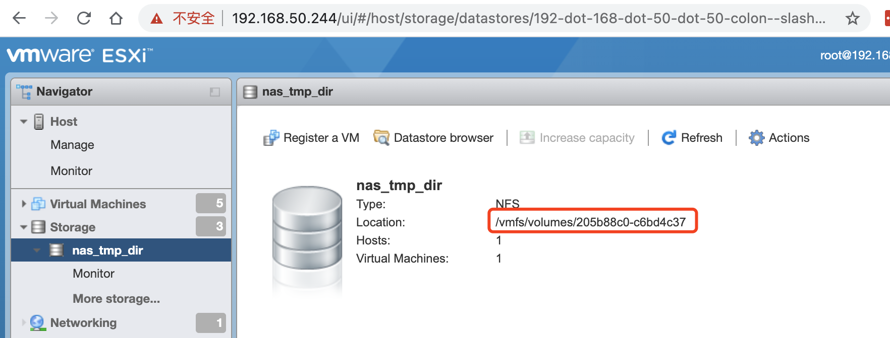
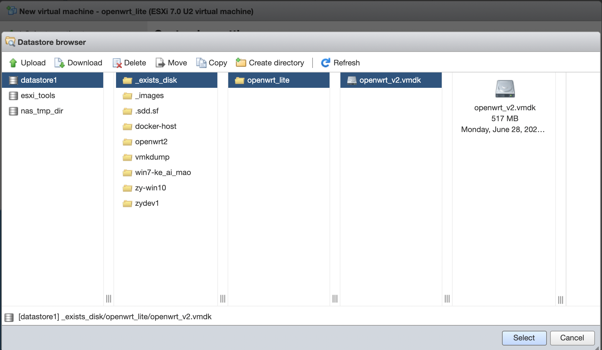

# Esxi安装OpenWrt旁路由

## 1. 简介

OpenWrt的版本：

- [openwrt eSir大佬版本](https://openwrt.club/dl)
  - 分`精品小包`和`高大全版本`。我使用了`精品小包`。
- [恩山OpenWrt](https://www.right.com.cn/forum/thread-4053752-1-1.html)


## 2. Esxi教程

家里弄了个Intel NUC 11做Homelab，装了Esxi，开一台虚拟机装`Openwrt`实现科学上网。

### 2.1 安装Openwrt

**2.1.1 下载OpenWrt的固件：**找一个Openwrt固件下载，我这里用的[OpenWrt eSir](https://openwrt.club/dl)精品小包版本。

**2.1.2 制作镜像**

>  安装的教程主要参考这里：[如何在#VMWare #ESXi 6.7上安装OpenWrt虚拟机充当旁路由](https://xmanyou.com/vmware-esxi-install-openwrt/)

简单介绍一下步骤：

```bash
# 1. 下载，并解压
gzip -d ./openwrt-spp-v6-1\[2021\]-x86-64-generic-squashfs-legacy.img.gz

# 2. 解压获取到：openwrt-spp-v6-1[2021]-x86-64-generic-squashfs-legacy.img

# 3. 将img转换为vmdk。需要安装 qemu-img
# 先用个简单的名字
mv openwrt-spp-v6-1[2021]-x86-64-generic-squashfs-legacy.img openwrt.img

qemu-img convert -f raw -O vmdk openwrt.img openwrt.vmdk
```

由于是提供给Esxi使用，所以上面的vmdk还需要再转换一次。

> qmeu-img只能将.img文件转换为VMWare Player、VMWare Fushion或者VMware Workstation支持的磁盘文件格式。
>
> 详见：[链接](https://xmanyou.com/vmware-esxi-install-openwrt/)

使用Esxi主机进行转换，Esxi开启ssh访问。

1. 通过浏览器打开ESXi虚拟机服务器的管理界面，登录

2. 主机->管理->服务，启动TSM-SSH


通过登陆Esxi主机，上传vmdk，然后使用`vmkfstools`进行转换。

我是通过`Storage`进行上传，上传后，能查看到对应的上传路径。



进行转换，

```bash
cd /vmfs/volumes/205b88c0-c6bd4c37

vmkfstools -i ./openwrt.vmdk openwrt_v2.vmdk
```

**2.1.3 安装系统**

有了上一步的vmdk镜像，可以开始安装相应的虚拟机了。直接参考：[3. 安装OpenWrt虚拟机](https://xmanyou.com/vmware-esxi-install-openwrt/)即可。

简单步骤为：

1. 创建新的的虚拟机。

   1. 操作系统版本我选择的是：
      1. ESXi 7.0 U2
      2. Linux
      3. Other Linux (64-bit)

2. 硬件配置：

   1. 删除默认的硬盘。

   2. 添加已经存在的硬盘，选择上面转换的openwrt_v2.vmdk。

      

   3. CPU、内存：1CPU + 2G内存

添加即可。

### 2.3 配置Openwrt


